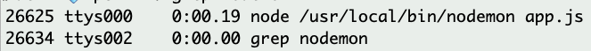

# npm & Express Response

| Term | Definition |
| ---- | ---------- |
| __Node__ | An open-source project that allows running JavaScript in the Terminal. Prior to Node.js, JavaScript could only be executed in the browser. |
| __npm__ | Node Package Manager (npm): An extensive library of third-party packages for Node.js, which can be easily installed and managed. |
| __Express__ | A JavaScript code framework hosted on npm, used for building web servers. It simplifies the process of creating server-side applications and handling HTTP requests and responses. |
| __Route__ | In Express, a route is like an event listener that listens for requests to a specific URL endpoint. It defines how the server should respond when a client makes a request to that URL.|
| __Request Object__ | The `request` object in Express represents the HTTP request sent by the client to the server. It contains information such as the URL, headers, query parameters, and request body. This object is used to retrieve and process the client's request data. |
| __Response Object__ | The `response` object in Express represents the HTTP response sent by the server back to the client. It is used to send data, set response headers, and control the response behavior. This object allows the server to communicate with the client and send the appropriate response based on the request. |

---

## Table of Contents

- [Editing `package.json`](#editing-packagejson)
- [Intializing an Express Application](#intializing-an-express-application)
- [Creating a basic route](#creating-a-basic-route)
- [Starting the server](#starting-the-server)
- [Putting it all together](#putting-it-all-together)
- [Nodemon](#nodemon)
- [grep and kill nodemon](#grep-and-kill-nodemon)

---

## Editing `package.json`

When editing the `package.json` file, it is important to follow proper JSON (JavaScript Object Notation) syntax. Here are some guidelines:

- Use double quotes (") instead of single quotes (') for strings.
- Place double quotes around object keys, numbers, and booleans.
- Ensure the JSON structure consists of valid JavaScript objects, arrays, and strings.
- Avoid using trailing commas at the end of objects or arrays.

---

## Intializing an Express Application

```js
// DEPENDENCIES
const express = require('express');

// CONFIGURATION
const app = express();
```

<details>
<summary><strong>What is the purpose of the <code>const express = require("express")</code> statement in the code?</strong></summary>

The `require("express")` statement imports the Express module, allowing us to use its functionalities in our code. By assigning it to the `express` constant, we can access the Express features and create an Express application.
</details>

<details>
<summary><strong>What does <code>const app = express()</code> do in the code?</strong></summary>

`const app = express()` creates an instance of the Express application. We assign it to the `app` constant, which we can then use to define routes and set up the server.
</details>

---

## Creating a basic route

```js
// ROUTES
app.get("/", (request, response) => {
  response.send("Hello World");
});
```

<details>
<summary><strong>What does <code>app.get('/', (request, response) => { ... })</code> define in the Express application?</strong></summary>

This code defines a route for handling HTTP GET requests to the root path (`/`) of the server. The callback function `(request, response) => { ... }` specifies the actions to be taken when a GET request is received at the root path.
</details>

<details>
<summary><strong>What is the purpose of <code>response.send('Hello World')</code>?</strong></summary>

`response.send('Hello World')` is used to send the response back to the client when a request is made to the defined route. In this case, it sends the string `'Hello World'` as the response, which will be displayed in the client's browser or application.
</details>

<details>
<summary><strong>What is the significance of using the root path <code>'/'</code> in <code>app.get('/', ...)</code>?</strong></summary>

Using the root path `'/'` as the route in `app.get('/', ...)` means that the route will be triggered when a client accesses the main URL of the server (e.g., `http://localhost:3003/`). It serves as the entry point for the application.
</details>

<details>
<summary><strong>How would you make a request for the <code>/universe</code> route instead?</strong></summary>

To make a request for the `/universe` route, you would need to modify the code to define a new route. For example:

```js
app.get('/universe', (request, response) => {
  response.send('Welcome to the universe!');
});
```
</details>

<details>
<summary><strong>How can you modify the code to handle a POST request instead of a GET request?</strong></summary>

To modify the code to handle a POST request, you can change `app.get` to `app.post` and update the corresponding callback function to handle the POST request logic. For example:

```js
app.post('/', (request, response) => {
  response.send('This is a POST request');
});
```
</details>

<details>
<summary><strong>Can you explain the purpose of the request and response parameters in the callback function?</strong></summary>

- The `request` parameter represents the HTTP request sent by the client to the server. It contains information about the request, such as the URL, headers, query parameters, and request body. The `request` object allows us to access and process the data sent by the client.

- The `response` parameter represents the HTTP response sent by the server back to the client. It is used to send data, set response headers, and control the response behavior. By using the `response` object, we can send the appropriate response to the client based on the received request.
</details>

---

## Starting the server

```js
// CONFIGURATION
const PORT = 3003;

// LISTENER
app.listen(PORT, () => {
  console.log(`Server listening on port ${PORT}`);
});
```

<details>
<summary><strong>What does <code>app.listen(PORT, () => { ... })</code> do in the code?</strong></summary>

`app.listen(PORT, () => { ... })` starts the server and makes it listen for incoming requests on the specified `PORT`. Once the server is running, the callback function is executed, which in this case logs a message to the console confirming that the server is listening on the specified port.
</details>

<details>
<summary><strong>How can you access the Express application in a web browser after running this code?</strong></summary>

After running the code and starting the server, you can access the Express application by opening a web browser and entering the URL `http://localhost:3003` (assuming the server is running on port `3003`). The browser will send a GET request to the server, and the defined route for '/' will handle the request and send the response, which will be displayed in the browser.
</details>

<details>
<summary><strong>What would happen if you change the port number to a different value?</strong></summary>

If you change the port number to a different value in the `PORT` constant and start the server, the Express application will listen for incoming requests on the new port instead. To access the application in a web browser, you would need to use the updated port number in the URL (e.g., `http://localhost:<new_port>`).
</details>

<details>
<summary><strong>How can you gracefully shut down the Express application when it's running?</strong></summary>

To gracefully shut down the Express application when it's running, you can press `Ctrl + C` in the terminal or command prompt where the server is running. This keyboard shortcut sends a signal to the server process, causing it to terminate and release the port it was using. After shutting down the server, the application will no longer be accessible.
</details>

---

## Putting it all together

```js
// DEPENDENCIES
const express = require('express');

// CONFIGURATION
const app = express();
const PORT = 3003;

// ROUTES
app.get("/", (request, response) => {
  response.send("I love express!");
});

// LISTENER
app.listen(PORT, () => {
  console.log("I am listening for requests on port 3003!");
});
```

---

## Nodemon

| Term | Definition |
| ---- | ---------- |
| __Nodemon__ | A tool that monitors your Node.js application for file changes and automatically restarts the server whenever a file is modified and saved. This helps streamline the development workflow by eliminating the need to manually restart the server after every code change. |

<details>
<summary><strong>What is the purpose of nodemon in a Node.js application development workflow?</strong></summary>

The purpose of nodemon in a Node.js application development workflow is to monitor the files in your project and automatically restart the Node.js server whenever a file is modified and saved. It eliminates the need to manually stop and restart the server after each code change, providing a seamless development experience.
</details>

<details>
<summary><strong>How does nodemon help streamline the development process when working with Node.js applications?</strong></summary>

Nodemon streamlines the development process by eliminating the need for manual server restarts. It saves developers time and effort by automatically detecting file changes and restarting the server. With nodemon, developers can focus on writing code and testing changes without the interruption of manually restarting the server after every modification.
</details>

<details>
<summary><strong>How can you install nodemon globally using npm?</strong></summary>

To install nodemon globally using npm, you can run the following command in your terminal or command prompt:

```bash
npm install -g nodemon
```

The `-g` flag indicates that nodemon should be installed globally, making it accessible as a command-line tool across your entire system.
</details>

<details>
<summary><strong>What happens when a file is modified and saved while nodemon is running?</strong></summary>

When a file is modified and saved while nodemon is running, nodemon detects the change and automatically restarts the Node.js server. It re-executes the application, loading the updated code, and allows you to see the changes immediately without having to manually restart the server.
</details>

<details>
<summary><strong>How can you start the server using nodemon after installing it globally?</strong></summary>

After installing nodemon globally, you can start the server using nodemon by running the following command in your project directory:

```bash
nodemon your-server-file.js
```

Replace `your-server-file.js` with the actual filename of your Node.js server file. Nodemon will monitor the file for changes and start the server, providing automatic restarts whenever you save changes to the file.
</details>

---

## grep and kill nodemon

| Term | Definition |
| ---- | ---------- |
| `ps` | process status |
| `grep` | global regular expression print |

If you don't properly shut down your server before putting your computer to sleep or attempt to run Nodemon on the same port multiple times, you may encounter issues with Nodemon running in the background processes.

1. Find the Process

    To find the process number associated with Nodemon, use the command: `ps -A | grep Nodemon`. This command retrieves the process status (`ps`) of all processes (`-A`) and uses the `grep` command to specifically search for the term `"Nodemon"`.

    

    *On the left, you will see the process number. In this case, it is `26625`.*

2. Kill the Process

    To terminate the Nodemon process, use the command `kill 26625` (replace `26625` with the process number you obtained).

__*It is good practice to gracefully exit programs to avoid the need for additional troubleshooting steps like the ones mentioned above.*__