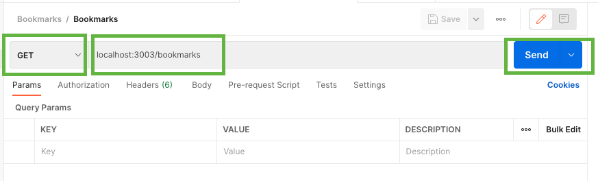
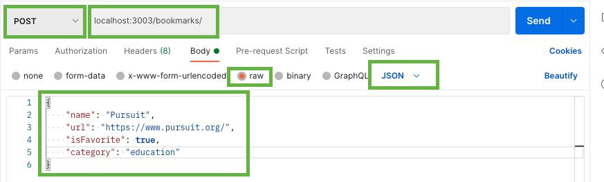
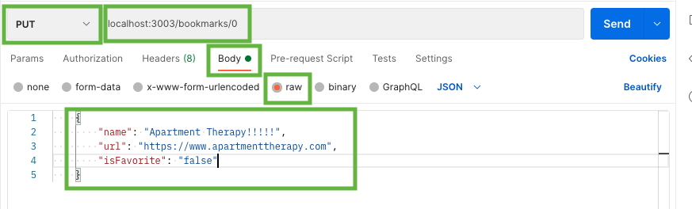

# Express RESTful Routes

> 📘 A Quick Note Before You Continue
>
> Many of the examples we'll show in this guide have been covered in the [Express CRUD](./05-express-crud.md) guide. If you're still getting used to CRUD operations, we recommend reviewing that guide first.

| Term | Definition |
| ---- | ---------- |
| __REST__ | REST (Representational State Transfer) is an architectural style for designing web services. It uses standard HTTP methods (GET, POST, PUT, DELETE) and lightweight formats (JSON, XML) to create scalable and stateless applications. |
| __RESTful Routing__ | RESTful routing is the practice of mapping HTTP requests to specific URLs in a web application. It follows REST principles and uses HTTP methods for CRUD operations on resources, resulting in clean and predictable API endpoints. |
| __Endpoint__ | An endpoint is a URL in a web application that provides access to a specific resource. It acts as an entry point for an API and is associated with an HTTP method. For example, `/users` could be an endpoint to access user resources. |
| __HTTP Methods__ | HTTP methods (GET, POST, PUT, DELETE, PATCH) are actions performed on web resources. They allow for retrieving, creating, updating, or deleting resources. They align with [CRUD operations](./05-express-crud.md) and provide a standardized way to interact with resources in a RESTful API. |
| __Resource__ | A resource is an object or collection of objects accessible through an API. It can represent entities like users, blog posts, or images. Resources have unique identifiers and are operated upon using HTTP methods. For example, a `"users"` resource has individual user objects. |
| __Request Parameters__ | [Request parameters](./03-intro-to-express-request.md) provide additional information in an HTTP request. Query parameters are appended to the URL for filtering or sorting, while route parameters are part of the URL path and identify a specific resource. They allow clients to customize requests and retrieve specific data. |
| __Response Codes__ | Response codes are standardized codes returned by a server in response to an HTTP request. They indicate the outcome of the request and guide client behavior. Common codes include 200 (OK), 404 (Not Found), and 500 (Internal Server Error). |

## Table of Contents

- [RESTful Routes](#restful-routes)
- [Testing with Postman](#testing-with-postman)
- [Show Route](#show-route)
- [Create Route](#create-route)
- [Delete Route](#delete-route)
- [Update Route](#update-route)

---

## Restful Routes

|  #  |   Action   |      URL       | HTTP Verb |    CRUD    |                Description                 |
| :-: | :--------: | :------------: | :-------: | :--------: | :----------------------------------------: |
|  1  | **Create** |   /bookmarks   |   POST    | **C**reate |           Create a new bookmark            |
|  2  |  _Index_   |   /bookmarks   |    GET    |  **R**ead  |   Get a list (or index) of all bookmarks   |
|  3  |  **Show**  | /bookmarks/:id |    GET    |  **R**ead  | Get an individual view (show one bookmark) |
|  4  |   Update   | /bookmarks/:id |    PUT    | **U**pdate |             Update a bookmark              |
|  5  |  Destroy   | /bookmarks/:id |  DELETE   | **D**elete |             Delete a bookmark              |

---

## Testing with Postman

We'll be using Postman to test our RESTful routes. If you haven't already, [download and install Postman](https://www.postman.com/downloads/) on your computer.

---

## Show Route

```js
// SHOW
bookmarks.get("/:arrayIndex", (req, res) => {
  if (bookmarkArray[req.params.arrayIndex]) {
    res.json(bookmarkArray[req.params.arrayIndex]);
  } else {
    res.status(404).json({ error: "Not Found" });
  }
});
```

<details>
<summary><strong>What is the purpose of the code snippet shown above?</strong></summary>

The purpose of the code snippet is to handle a GET request to retrieve a specific bookmark from the `bookmarkArray` based on the `arrayIndex` provided in the URL.
</details>

<details>
<summary><strong>What will be the response if a valid <code>arrayIndex</code> is provided?</strong></summary>

The response will be the JSON representation of the bookmark located at the specified `arrayIndex` in the `bookmarkArray`.
</details>

<details>
<summary><strong>What will be the response if an invalid or non-existent <code>arrayIndex</code> is provided?</strong></summary>

The response will have a status code of 404 (Not Found) and a JSON object containing the error message: `{ "error": "Not Found" }`.
</details>

### Test with Postman



---

## Create Route

```js
// CREATE
bookmarks.post("/", (req, res) => {
  bookmarksArray.push(req.body);
  res.json(bookmarkArray[bookmarkArray.length - 1]);
});
```

<details>
<summary><strong>What is the purpose of the code snippet shown above?</strong></summary>

The purpose of the code snippet is to handle a POST request to create a new bookmark. The bookmark data provided in the request body is added to the `bookmarkArray`, and the newly added bookmark is returned as the response.
</details>

<details>
<summary><strong>What is the effect of `bookmarksArray.push(req.body);` in the code snippet?</strong></summary>

The line `bookmarksArray.push(req.body);` adds the data from the request body (containing the new bookmark) to the end of the `bookmarkArray`. It effectively creates a new bookmark by appending it to the existing array.
</details>

<details>
<summary><strong>What will be the response after a successful bookmark creation?</strong></summary>

The response will be the JSON representation of the newly created bookmark, which is the last element of the `bookmarkArray`.
</details>

### Test with Postman



---

## Delete Route

```js
// DELETE
bookmarks.delete("/:arrayIndex", (req, res) => {
  if (bookmarkArray[req.params.arrayIndex]) {
    const deletedBookMark = bookmarkArray.splice(req.params.arrayIndex, 1);
    res.status(200).json(deletedBookMark);
  } else {
    res.status(404).json({ error: "Not Found" });
  }
});
```

<details>
<summary><strong>What is the purpose of the code snippet shown above?</strong></summary>

The purpose of the code snippet is to handle a DELETE request to remove a specific bookmark from the `bookmarkArray` based on the `arrayIndex` provided in the URL.
</details>

<details>
<summary><strong>What is the effect of <code>bookmarkArray.splice(req.params.arrayIndex, 1);</code> in the code snippet?</strong></summary>

The line `bookmarkArray.splice(req.params.arrayIndex, 1);` removes one element from the `bookmarkArray` at the specified `arrayIndex`. It effectively deletes the bookmark from the array.
</details>

<details>
<summary><strong>What will be the response after a successful bookmark deletion?</strong></summary>

The response will have a status code of 200 (OK), and it will contain the JSON representation of the deleted bookmark in an array. The deleted bookmark is returned as confirmation of the deletion.
</details>

### Test with Postman


---

## Update Route

```js
// UPDATE
bookmarks.put("/:arrayIndex", validateURL, async (req, res) => {
  if (bookmarkArray[req.params.arrayIndex]) {
    bookmarkArray[req.params.arrayIndex] = req.body;
    res.status(200).json(bookmarkArray[req.params.arrayIndex]);
  } else {
    res.status(404).json({ error: "Not Found" });
  }
});
```

<details>
<summary><strong>What is the purpose of the code snippet shown above?</strong></summary>

The purpose of the code snippet is to handle a PUT request to update a specific bookmark in the `bookmarkArray` based on the `arrayIndex` provided in the URL.
</details>

<details>
<summary><strong>What is the effect of <code>bookmarkArray[req.params.arrayIndex] = req.body;</code> in the code snippet?</strong></summary>

The line `bookmarkArray[req.params.arrayIndex] = req.body;` updates the bookmark in the `bookmarkArray` at the specified `arrayIndex` with the data provided in the request body (`req.body`).
</details>

<details>
<summary><strong>What will be the response after a successful bookmark update?</strong></summary>

The response will have a status code of 200 (OK), and it will contain the JSON representation of the updated bookmark in the `bookmarkArray`. The updated bookmark is returned as confirmation of the successful update.
</details>

<details>
<summary><strong>What does the <code>validateURL</code> function represent in the code snippet?</strong></summary>

The `validateURL` function represents a middleware function that can be used to validate the URL provided in the request body or perform any other necessary validations before processing the request further. It is executed before the main request handler in the code snippet.

One possible way to write the `validateURL` function is shown below:

```js
const validateURL = (req, res, next) => {
  if (
    req.body.url.substring(0, 7) === "http://" ||
    req.body.url.substring(0, 8) === "https://"
  ) {
    return next();
  } else {
    res
      .status(400)
      .send(`Oops, you forgot to start your url with http:// or https://`);
  }
};
```

See the [Express Middleware](./06-express-middleware.md) guide for more information on middleware functions.
</details>

### Test with Postman

