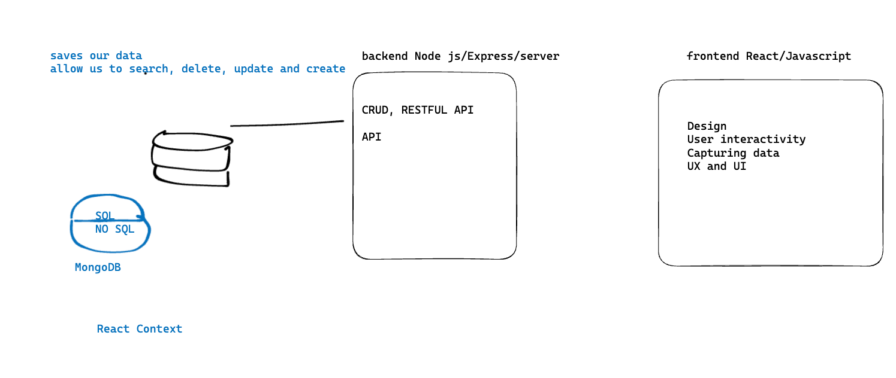

# Intro to Databases / SQL

| Term | Definition |
| ---- | ---------- |
| __Database__ | A database is an organized collection of data, generally stored and accessed electronically from a computer system. |
| __SQL__ | SQL (Structured Query Language) is a language designed to manipulate and manage data stored in relational databases. |
| __PostgreSQL__ | RESTful routing is the practice of mapping HTTP requests to specific URLs in a web application. It follows REST principles and uses HTTP methods for CRUD operations on resources, resulting in clean and predictable API endpoints. |
| __Schema__ | A database schema is the skeleton structure that represents the logical view of the entire database. It defines how the data is organized and how the relations among them are associated. |
| __Table__ | A table is a collection of related data held in a table format within a database. It consists of columns and rows. |
| __Column__ | A column is a vertical entity in a table that contains all information associated with a specific field in a table. |
| __Row__ | A row is a horizontal entity in a table. It is a collection of related data fields in a table. |

## Table of Contents

- [Environment Set Up](#environment-set-up)
- [SQL Syntax](#sql-syntax)
- [SQL Gotchas](#sql-gotchas)
- [Data Types](#data-types)
- [Comparison Operators](#comparison-operators)
- [Logical Operators](#logical-operators)
- [Database Commands](#database-commands)
  - [Create Database](#create-database)
  - [Drop Database](#drop-database)
  - [Connect to Database](#connect-to-database)
- [Table Commands](#table-commands)
    - [Create Table](#create-table)
    - [View Table](#view-table)
    - [Drop Table](#drop-table)
    - [Alter Table](#alter-table)
    - [Insert Into Table](#insert-into-table)
    - [Select From Table](#select-from-table)
    - [Update Table](#update-table)
    - [Delete From Table](#delete-from-table)
- [Advanced Table Commands](#advanced-table-commands)
    - [Limit](#limit)
    - [Offset](#offset)
    - [Order By](#order-by)
    - [Group By](#group-by)
    - [Aggregations](#aggregations)
    - [Combining Commands](#combining-commands)

---

## Environment Set Up

We will be using PostgreSQL for most of our web applications. Fortunately for MacOS X, we can use [Postgress.app](https://postgresapp.com/), which provides the database application and a command line interface (CLI) so we can interact with it.

__To install Postgres.app, download and follow the installation instructions from the website.__

Open the app and choose the `initialize` option.

Then, paste this command into the terminal.

```bash
sudo mkdir -p /etc/paths.d &&
echo /Applications/Postgres.app/Contents/Versions/latest/bin | sudo tee /etc/paths.d/postgresapp
```

Close and reopen the terminal tab to gain access to the `psql` command. Let's try it out.

```bash
# open the PostgreSQL CLI
$ psql

# you should be greeted with a prompt that looks like this
psql (12.X)
Type "help" for help.

yourname=#

# type '\q' to quit
yourname=# \q
```

---

## SQL Syntax

Even though keywords in SQL are not case-sensitive, the convention is to capitalize them.

```sql
-- correct
SELECT * FROM bookmarks;

-- incorrect
select * from bookmarks;
```

__Note:__ Comments in SQL are denoted by `--` or `/* */`.

Here are a couple more best practices to keep in mind.

```sql
-- When possible, use single quotes for strings
SELECT address, city, state FROM houses WHERE city = 'Monroe';

-- Use whitespace to make your queries easier to read
SELECT
    address,
    city,
    state
FROM
    houses
WHERE
    city = 'Monroe';
```

The query doesn't end until you add a semi-colon, so adding a new line for each keyword is a good practice.

---

## SQL Nuances and Gotchas

Postgres in the terminal gives you some cues, but they can be hard to spot as a new user.

- A prompt ready to go is preceded by `=#`.
    ```bash
    yourname=#
    ```
- Semi-colons are required to end your statement. If you forget your semi-colon, the prompt will drop to the following line and appear as a `-#`.
    ```bash
    yourname=# SELECT * FROM bookmarks
    yourname-#
    ```
- To fix this, add a semi-colon and press `return` or `enter`.
    ```bash
    yourname=# SELECT * FROM bookmarks
    yourname-# ;
    ```
- What happens if you get more data than can fit on the screen?

    You'll see a colon that will let you know there is more data, which you can use the down arrow to scroll through or press `q` to get your prompt back.

    ```bash
    yourname=# SELECT * FROM bookmarks;
    id | title | url | comment | category_id
    ----+-------+-----+---------+-------------
    1 | Google | http://www.google.com | Search Engine | 1
    2 | Reddit | http://www.reddit.com | Social Media | 2
    3 | Amazon | http://www.amazon.com | Shopping | 3
    4 | StackOverflow | http://www.stackoverflow.com | Q&A | 4
    5 | Github | http://www.github.com | Code Repo | 5
    :
    ```

---

## Data Types

Similar to JavaScript, we can use data types to define the type of data we want to store in our database. Here are a few common data types to get us started.

Check out the [PostgreSQL Data Types documentation](https://www.postgresql.org/docs/current/datatype.html) for more information.

| Data Type | Description |
| --------- | ----------- |
| ```INT``` OR ```INTEGER``` | A whole number. |
| ```DECIMAL``` | A number with a decimal point. |
| ```BOOL``` OR ```BOOLEAN``` | A true or false value. |
| ```VARCHAR(n)``` | A string of characters where `n` is the maximum number of characters. |
| ```TEXT``` | A string of characters with no maximum length. |
| ```TIMESTAMP``` | A date and time. |
| ```SERIAL``` | A number that increases with each addition. |


---

## Comparison Operators

Additionally, we can use comparison operators to compare values in SQL. Here are a few common ones.

Check out the [PostgreSQL Comparison Operators documentation](https://www.postgresql.org/docs/current/functions-comparison.html) for more information.

| Operator | Description |
| -------- | ----------- |
| ```=``` | Equal to |
| ```!=``` OR ```<>``` | Not equal to |
| ```>``` | Greater than |
| ```<``` | Less than |
| ```>=``` | Greater than or equal to |
| ```<=``` | Less than or equal to |
| ```IS NULL``` | Is null |
| ```IS NOT NULL``` | Is not null |
| ```LIKE``` | Matches a pattern |
| ```ILIKE``` | Matches a pattern (case insensitive) |
| ```IN``` | Matches any value in a list |
| ```NOT IN``` | Does not match any value in a list |
| ```BETWEEN``` | Between a range of values |
| ```NOT BETWEEN``` | Not between a range of values |

---

## Logical Operators

We can also use logical operators to combine multiple conditions in SQL.

Check out the [PostgreSQL Logical Operators documentation](https://www.postgresql.org/docs/current/functions-logical.html) for more information.

| Operator | Description |
| -------- | ----------- |
| ```AND``` | Both conditions must be true |
| ```OR``` | Either condition must be true |
| ```NOT``` | Negates a condition |

---

## Database Commands

### Create Database

```sql
-- When possible use a simple database name in all lowercase
CREATE DATABASE foo;

-- Underscores work well to separate words
CREATE DATABASE my_database;

-- If you'd like to use a hyphen, you'll need to wrap the name in double quotes
CREATE DATABASE "my-database";
```

### Drop Database

```sql
-- Drop (delete) a database
DROP DATABASE foo;

-- Drop (delete) a database if it exists
DROP DATABASE IF EXISTS foo;
```

### Connect to Database

```sql
-- Connect to a database
\connect foo;

-- Shorthand for connecting to a database
\c foo;

-- Connect to a database with a username
\c foo username;

-- Connect to a database with a username and password
\c foo username password;
```

---

## Table Commands

### Create Table

```sql
-- create a table called 'foo' with one column called 'name', which is a text column
CREATE TABLE foo (name TEXT);

-- create a multi-column table called 'houses' with the following columns:
    -- id (serial)
    -- address (text) REQUIRED
    -- city (text)
    -- state (varchar(2))
    -- price (integer)
    -- pool (boolean)
    -- for_sale (boolean)
CREATE TABLE houses (
    id SERIAL,
    address TEXT NOT NULL,
    city TEXT,
    state VARCHAR(2),
    price INT,
    pool BOOL,
    for_sale BOOL
);
```

### View Table

```sql
-- List all of the tables in the current database
\dt

-- View the structure of the "houses" table
\d houses
```


### Drop Table

```sql
-- drop (delete) a table
DROP TABLE foo;

-- drop (delete) a table if it exists
DROP TABLE IF EXISTS foo;
```

### Alter Table

__IMPORTANT__: You cannot roll back changes or undo deletes with a PostgreSQL database. When working in production, be sure to have backup systems in place.

```sql
-- add a test string column
ALTER TABLE houses ADD COLUMN test TEXT;

-- drop the test column
ALTER TABLE houses DROP COLUMN test;

-- rename a column
ALTER TABLE houses RENAME st TO state;

-- rename a table
ALTER TABLE Houses RENAME TO houses;
```

Try checking out the structure of the table after each of these commands.

### Insert Into Table

__NOTE__: You have to match the order of the columns in the table when inserting data.

```sql
-- Wrong Order (will result in an error)
INSERT INTO
    houses (address, pool, price, state, city, for_sale)
VALUES
    ('99 Sunnyside Drive', TRUE, 100, 'NY', 'Springfield', true);

-- Correct Order
INSERT INTO
    houses (address, city, state, price, pool, for_sale)
VALUES
    ('99 Sunnyside Drive', 'Springfield', 'NY', 100, true, true);

-- On Success, you should see a message like this:
INSERT 0 1
```

You don't have to provide all the fields when inserting data, just the required ones.

```sql
-- Insert a row with only the required fields
-- (Required fields are identified by NOT NULL when creating the table or column)
INSERT INTO
 houses (address)
VALUES
('11 Main Street');
```

You can also insert multiple rows at once.

```sql
-- Insert multiple rows at once
INSERT INTO
    houses (address, city, state, price, pool, for_sale)
VALUES
    ('2 Maple Court', 'Monroe', 'NY', 200, false, true),
    ('50 Beech Street', 'Bacon', 'IN', 75, null , null),
    ('101 Willow Avenue', 'Twin Peaks', 'WA', 300, null, null),
    ('2300 Orchard Lane', 'Monroe', 'NC', 150, null, true),
    ('57 Sycamore Boulevard', 'Monroe', 'CT', 275, false, false),
    ('88 Hemlock Grove', 'Eek', 'AK', 200, true, true),
    ('109 Pine Drive', 'Happyland', 'CT', 220, false, null);
```

### Select From Table

Let's start with some basic select statements.

```sql
-- select all columns from the houses table
SELECT * FROM houses;

-- select all rows from the house's table, display only the address column
SELECT address FROM houses;

-- select all rows from the house's table, display only the address and state column
SELECT address, state FROM houses;
```

Next, let's add some comparison operators to our select statements.

```sql
-- select all rows from the house's table where the city column is set to 'Monroe'
SELECT * FROM houses WHERE city = 'Monroe';

-- select all rows from the house's table where the state column is set to 'ny' or 'Ny' or 'NY' (case insensitive)
SELECT * FROM houses WHERE state ILIKE 'NY';

-- select all rows from the house's table where the address column contains 'Drive'
SELECT * FROM houses WHERE address LIKE '%Drive%';

-- select all rows from the house's table where the price is set to 200
SELECT * FROM houses WHERE price = 200;

-- select all rows from the house's table where the price column is not set to 180
SELECT * FROM houses WHERE price != 180;

-- select all rows from the house's table where the price column is greater than 165
SELECT * FROM houses WHERE price > 165;

 -- select all rows from the house's table where the price column is less than 165
SELECT * FROM houses WHERE price < 165;

-- select all rows from the house's table where the price column is greater than or equal to 165
SELECT * FROM houses WHERE price >= 165;

-- select all rows from the house's table where the price column is less than or equal to 165
SELECT * FROM houses WHERE price <= 165;

-- select all rows from the house's table where the price column is null
SELECT * FROM houses WHERE price IS NULL;

-- select all rows from the house's table where the pool column has a value
SELECT * FROM houses WHERE pool IS NOT NULL;
```

Let's take it one step further and combine some of these conditions.

```sql
-- select all rows from the house's table
-- WHERE the city column is set to 'Monroe'
-- AND the state column is set to 'CT'
SELECT * FROM houses WHERE city = 'Monroe' AND state = 'CT';

-- select all rows from the house's table
-- WHERE either the pool column is set to TRUE
-- OR the city column is set to 'Twin Peaks'
SELECT * FROM houses WHERE pool = TRUE OR city = 'Twin Peaks';
```

### Update Table

Let's start with a small update to our houses table.

```sql
-- Update whether or not the house at id 7 has a pool
UPDATE houses SET pool = TRUE WHERE id = 7;
```

You may notice that the update command does not return any data. If you want to see the data that was updated, you can use the `RETURNING` keyword.

```sql
-- Update whether or not the house at id 7 has a pool and return the updated row
UPDATE houses SET pool = TRUE WHERE id = 7 RETURNING *;
```

The `RETURNING` keyword can be used with any command that returns data, including `INSERT`, `UPDATE`, and `DELETE`.

### Delete From Table

Let's start by deleting a single row.

```sql
-- Delete the house at id 1
DELETE FROM houses WHERE id = 1;
```

Next is a more complicated example where we delete multiple rows using a comparison operator; then we return the address and state of the deleted rows.

```sql
-- Delete all houses where the city is set to 'Monroe'
DELETE FROM houses WHERE city = 'Monroe' RETURNING address, state;
```

---

## Advanced Table Commands

### Limit

We can use the `LIMIT` keyword to limit the number of rows returned by a query.

```sql
-- select all rows from the house's table, but show only the first row
SELECT * FROM houses LIMIT 1;
```

### Offset

If we were to imagine pagination for our store, we would also want to `OFFSET` (start at a later row) the responses on upcoming pages.

```sql
-- For comparison to the next one
SELECT * FROM houses;
-- select all rows from the house's table, but show only one row. Skip the first row
SELECT * FROM houses LIMIT 1 OFFSET 1;
```

### Order By

We can use the `ORDER BY` keyword to sort the results of a query.

```sql
-- select all rows from the houses table, order by city alphabetically
SELECT * FROM houses ORDER BY city ASC;

-- select all rows from the houses table, order by city reverse alphabetically
SELECT * FROM houses ORDER BY city DESC;

-- select all rows from the houses table, order by price ascending
SELECT * FROM houses ORDER BY price ASC;

-- select all rows from the houses table, order by price descending
SELECT * FROM houses ORDER BY price DESC;
```

### Group By

We can use the `GROUP BY` keyword to group the results of a query.

```sql
-- select all rows from the houses table, group by city
SELECT * FROM houses GROUP BY city;

-- select all rows from the houses table, group by city and state
SELECT * FROM houses GROUP BY city, state;
```

### Aggregations

An aggregation is a function that takes a set of values and returns a single value. Some common aggregations include:

| Aggregation | Description |
| ----------- | ----------- |
| ```COUNT``` | Returns the number of rows in a table. |
| ```SUM``` | Returns the sum of all values in a column. |
| ```AVG``` | Returns the average of all values in a column. |
| ```MIN``` | Returns the minimum value in a column. |
| ```MAX``` | Returns the maximum value in a column. |

```sql
-- select the number of rows in the houses table
SELECT COUNT(*) FROM houses;

-- select the sum of all prices in the houses table
SELECT SUM(price) FROM houses;

-- select the average price of all houses in the houses table
SELECT AVG(price) FROM houses;

-- select the minimum price of all houses in the houses table
SELECT MIN(price) FROM houses;

-- select the maximum price of all houses in the houses table
SELECT MAX(price) FROM houses;
```

### Combining Commands

We can combine many of these commands to create more complex queries.

```sql
-- Divide all rows into groups by the address, city and state columns
-- Show the number of rows in each group, as well as the address, city, and state of each group
SELECT COUNT(*), address, city, state FROM houses GROUP BY address, city, state;

 -- Show the SUM of all the house prices.
SELECT SUM(price) FROM houses WHERE price IS NOT NULL;

 -- Show the SUM of all the house prices where the pool is true
SELECT SUM(price) FROM houses WHERE pool IS TRUE;

-- Divide all rows into groups by whether or not they are for sale
-- Show the AVG of the price of each group
-- Show the for_sale property of each group
SELECT AVG(price), for_sale FROM houses GROUP BY for_sale;

-- Divide all rows into groups by for_sale.
-- Show the MAX of the price of each group.
-- Show the for_sale of each group
SELECT MAX(price), for_sale FROM houses GROUP BY for_sale;
```

## Class Drawings

In class, Pak drew out the following diagram to help us understand how the database relates to the backend (NodeJS, Express) and the frontend (React/Javascript). This is a great reference to keep in mind as we move forward.

