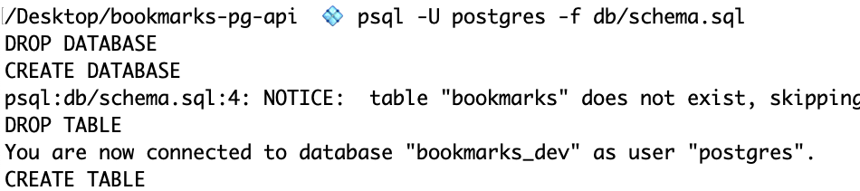
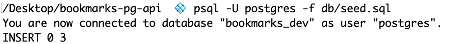

# Express & SQL

| Term | Definition |
| ---- | ---------- |
| __pg__ | A non-blocking PostgreSQL client for Node.js. Pure JavaScript and optional native libpq bindings. |
| __SQL Injection__ | SQL injection is a code injection technique, used to attack data-driven applications, in which nefarious SQL statements are inserted into an entry field for execution. |
| __ORM__ | Object-relational mapping (ORM, O/RM, and O/R mapping tool) in computer science is a programming technique for converting data between incompatible type systems using object-oriented programming languages. |
| __Sequelize__ | Sequelize is a promise-based ORM for Node.js. |

## Table of Contents

- [Seed & Reed](#seed-reed)
  - [Getting Started](#getting-started)
  - [Bookmarks Controller](#bookmarks-controller)
  - [Setting Up the Database](#setting-up-the-database)
    - [SQL Files](#sql-files)
  - [Adding postgres/pg-promise](#adding-postgrespg-promise)
  - [Querying the Database](#querying-the-database)
  - [Test It Out](#test-it-out)
  - [Save It](#save-it)

## Seed & Reed

### Getting Started

- Create a new project directory called `bookmarks` and `cd` into it.
- Create a `.gitignore` file using the touch command:

  ```bash
  touch .gitignore
  ```

- Setup your `.gitignore` file to ignore the `node_modules`, `.env`, and `.DS_Store` files.

  ```
  node_modules
  .env
  .DS_Store
  ```

- Finish initializing your project:

  ```bash
  git init
  git add -A
  git commit -m "initial commit"
  touch server.js
  npm init -y
  touch app.js .env
  npm install express dotenv cors morgan
  ```

- Setup your `.env` file:

  ```
  PORT=3001
  ```

- Setup your `app.js` file:

  ```js
  // DEPENDENCIES
  const cors = require("cors");
  const express = require("express");
  const morgan = require("morgan");

  // CONFIGURATION
  const app = express();

  // MIDDLEWARE
  app.use(cors());
  app.use(express.json());
  app.use(morgan("dev"));

  // ROUTES
  app.get("/", (req, res) => {
    res.send("Welcome to Bookmarks App");
  });

  // EXPORT
  module.exports = app;
  ```

- Setup your `server.js` file:

  ```js
  // DEPENDENCIES
  const app = require("./app.js");

  // CONFIGURATION
  require("dotenv").config();
  const PORT = process.env.PORT;

  // LISTEN
  app.listen(PORT, () => {
    console.log(`Listening on port ${PORT}`);
  });
  ```

### Bookmarks Controller

- Create a new directory called `controllers` and add a new file called `bookmarks.controller.js`:

  ```bash
  mkdir controllers
  touch controllers/bookmarks.controller.js
  ```

- Setup your `bookmarks.controller.js` file:

  ```js
  const express = require("express");
  const bookmarks = express.Router();

  // INDEX
  bookmarks.get("/", (req, res) => {
    res.json({ status: "ok" });
  });

  module.exports = bookmarks;
  ```

- Add the `/bookmarks` route and a 404 route to your `app.js` file:

  ```js
  // Bookmarks ROUTES
  const bookmarksController = require("./controllers/bookmarkController.js");
  app.use("/bookmarks", bookmarksController);

  // 404 PAGE
  app.get("*", (req, res) => {
    res.status(404).send("Page not found");
  });
  ```

- Test out your new bookmarks route: `http://localhost:3001/bookmarks`

### Setting Up the Database

- **COMMON ERROR ALERT**
  - Do not name a database and a table the same name.
  - Example: database `bookmarks` & table `bookmarks` - this will cause errors.
  - We will call our database `bookmarks_dev` and our table `bookmarks`.
<br><br>

- Setup the database (db) folder:

  ```bash
  mkdir db
  touch db/schema.sql db/seed.sql
  ```

- Setup your `schema.sql` file:

  ```sql
  -- SCHEMA.SQL
  -- The representation of your data model and will also contain db/table(s) set up.

  DROP DATABASE IF EXISTS bookmarks_dev;
  CREATE DATABASE bookmarks_dev;

  \c bookmarks_dev;

  CREATE TABLE bookmarks (
    id SERIAL PRIMARY KEY,
    name TEXT NOT NULL,
    url TEXT,
    category TEXT,
    is_favorite BOOLEAN
  );
  ```

- Run the `schema.sql` file in the terminal:

  ```bash
  # This line of code says, run the app psql, use the User postgres and run the file db/schema.sql.

  psql -U postgres -f db/schema.sql
  ```

  **Success** should look like this:

  

- Setup your `seed.sql` file:

  ```sql
  \c bookmarks_dev;

  INSERT INTO bookmarks (name, url, category, is_favorite) VALUES
  ('MDN', 'https://developer.mozilla.org/en-US/', 'educational', true),
  ('Apartment Therapy', 'https://www.apartmenttherapy.com', 'inspirational', true),
  ('DMV', 'https://dmv.ny.gov', 'adulting', true);
  ```

- Run the `seed.sql` file in the terminal:

  ```bash
  psql -U postgres -f db/seed.sql
  ```

  **Success** should look like this:

  

